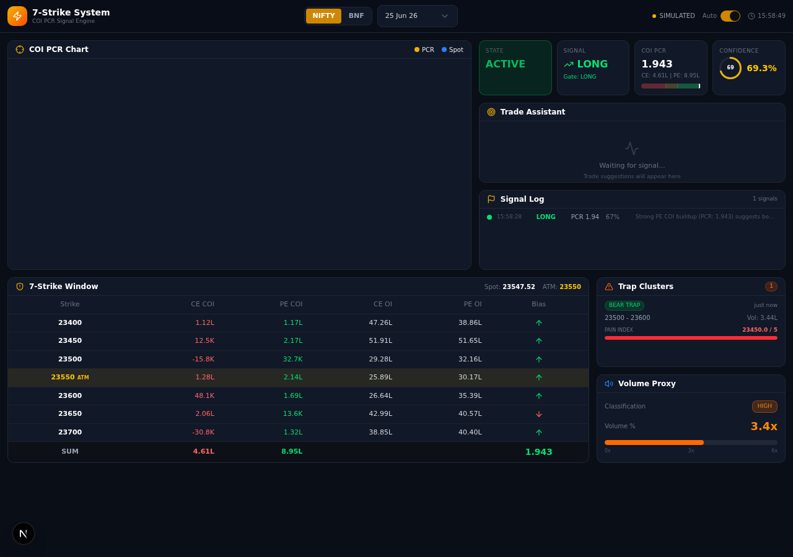

# 7Strike Terminal — Indian Options Trading Terminal

> Real-time 7-Strike COI PCR Signal System for NIFTY & BANKNIFTY options trading with live Upstox data integration.



---

## ✨ Features

- 🔴 **Live Upstox Data** — Real-time option chain, candles, OI/COI via official Python SDK (v2.27.0)
- 📊 **7-Strike COI PCR Signal System** — ATM ±3 strike window for signal generation
- 📈 **Interactive Charts** — lightweight-charts v5 candlestick with canvas OI/COI bar overlay
- 📋 **Option Chain Table** — ATM ±10 strikes with CE/PE LTP, OI, Change OI
- 🔍 **Instrument Search** — Search "NIFTY 23900 CE" and jump to that instrument instantly
- 📉 **PCR Indicator** — Real-time PCR from live OI data
- 🎯 **Signal Matrix** — LONG/SHORT/NEUTRAL with confidence scores
- 💰 **Trade Suggestions** — Entry, SL, Target with risk-reward ratios
- 🗄️ **DuckDB Storage** — Historical data for replay and analytics
- 🌙 **Dark Theme** — Professional trading terminal UI

---

## 🚀 Quick Start

### Prerequisites

| Requirement | Version | Install |
|------------|---------|---------|
| **Node.js** | 18+ | [nodejs.org](https://nodejs.org) |
| **Bun** | Latest | [bun.sh](https://bun.sh) |
| **Python** | 3.10+ | [python.org](https://python.org) |
| **Git** | Latest | [git-scm.com](https://git-scm.com) |
| **Upstox Account** | Active | [upstox.com](https://upstox.com) |

### Option A: Windows (One-Click)

```powershell
# First-time setup (installs all dependencies)
.\setup.ps1

# Start both services (Python engine + Next.js)
.\start.ps1
```

Or use batch files:
```cmd
setup.bat
start.bat
```

### Option B: Linux / macOS (One-Click)

```bash
# First-time setup (installs all dependencies)
chmod +x setup.sh && ./setup.sh

# Start both services (Python engine + Next.js)
./start.sh
```

### Option C: Manual Setup

```bash
# 1. Clone the repository
git clone <repo-url>
cd 7strike-terminal

# 2. Install frontend dependencies
bun install

# 3. Install Python dependencies
cd python-engine
pip3 install -r requirements.txt
pip3 install "upstox-python-sdk @ git+https://github.com/upstox/upstox-python.git"
cd ..

# 4. Configure your Upstox access token
cp .env.example .env
# Edit .env and add your UPSTOX_ACCESS_TOKEN

# 5. Start Python engine (Terminal 1)
cd python-engine
python3 -m uvicorn main:app --host 0.0.0.0 --port 3035

# 6. Start Next.js frontend (Terminal 2)
bun run dev
```

### ✅ Verify

Open [http://localhost:3000](http://localhost:3000) — you should see the terminal with live data.

Check Python engine health:
```bash
curl http://localhost:3035/api/health
# Expected: {"mode": "live", "connected": true, ...}
```

### ⏹️ Stopping

| Method | How |
|--------|-----|
| **One-click scripts** | Press `Ctrl+C` in the terminal running `start.ps1` / `start.sh` |
| **Manual** | Kill the Python process (`Ctrl+C` in Terminal 1) and the Bun process (`Ctrl+C` in Terminal 2) |
| **Force kill** | Windows: `taskkill /F /IM python.exe /T` and `taskkill /F /IM node.exe /T` · Linux: `kill $(lsof -ti:3035)` and `kill $(lsof -ti:3000)` |

---

## 🔑 Getting Your Upstox Access Token

1. Go to [Upstox Developer Console](https://developer.upstox.com/)
2. Create an app (or use existing)
3. Use the OAuth flow to get an access token
4. Token is valid for ~8 hours — refresh when expired
5. Add to `.env` file: `UPSTOX_ACCESS_TOKEN=your_token_here`

You can also update the token at runtime via the Settings dialog in the terminal UI.

---

## 🏗️ Architecture

```
Browser → Next.js (:3000) → Python Engine (:3035) → Upstox Python SDK → Upstox API
                                  ↓
                              DuckDB (Historical)
```

**Key principle:** All Upstox API calls go through the Python engine using the official SDK. The TypeScript frontend never calls Upstox directly.

📖 See [ARCHITECTURE.md](ARCHITECTURE.md) for the full architecture document.

---

## 📁 Project Structure

```
7strike-terminal/
├── python-engine/              # 🐍 FastAPI backend (Upstox SDK)
│   ├── main.py                #   FastAPI app entry point (port 3035)
│   ├── upstox_api.py          #   Upstox SDK wrapper + caching + run_in_executor
│   ├── market_engine.py       #   Core orchestration + 7-strike logic
│   ├── config.py              #   Environment config + mappings
│   ├── db.py                  #   DuckDB schema + CRUD
│   ├── models.py              #   Pydantic data models
│   ├── requirements.txt       #   Python dependencies
│   └── routes/                #   API route handlers
│       ├── instruments.py     #     Search & expiries
│       ├── candles.py         #     Candle data
│       ├── options.py         #     Option chain + OI
│       ├── pcr.py             #     PCR data
│       ├── seven_strike.py    #     7-Strike signals
│       └── replay.py          #     Historical replay
│
├── src/                        # ⚛️ Next.js 16 frontend
│   ├── app/                   #   App Router pages + API routes
│   │   ├── page.tsx           #     Main terminal page (only visible route)
│   │   ├── layout.tsx         #     Root layout
│   │   └── api/               #     Proxy routes → Python engine
│   │       ├── candles/       #       Candle data proxy
│   │       ├── option-chain/  #       Option chain proxy
│   │       ├── instruments/   #       Search & expiries proxy
│   │       ├── pcr/           #       PCR proxy
│   │       ├── health/        #       Health check proxy
│   │       ├── config/        #       Upstox config proxy
│   │       ├── 7strike/       #       7-Strike proxy
│   │       └── replay/        #       Replay proxy
│   ├── components/
│   │   ├── terminal/          #     Trading terminal components
│   │   │   ├── spot-chart.tsx           #  Main chart + canvas OI overlay
│   │   │   ├── option-chart.tsx         #  CE/PE option charts
│   │   │   ├── instrument-search.tsx    #  Search box → SDK search
│   │   │   ├── mini-option-chain.tsx    #  Option chain table
│   │   │   ├── pcr-chart.tsx            #  PCR indicator
│   │   │   ├── top-bar.tsx              #  Header bar
│   │   │   ├── connection-status.tsx    #  LIVE/OFFLINE badge
│   │   │   ├── quick-order.tsx         #  Order panel
│   │   │   ├── timeframe-selector.tsx   #  TF buttons
│   │   │   └── upstox-config-dialog.tsx #  Token config
│   │   └── ui/                #     shadcn/ui primitives
│   ├── hooks/                 #   Custom React hooks
│   │   ├── use-market-data.ts       # Data fetching (candles, chain, PCR, expiries)
│   │   └── use-trading-engine.ts    # Engine connection
│   ├── store/                 #   Zustand state
│   │   └── trading-store.ts         # Central state management
│   └── lib/                   #   Utility libraries
│       ├── data-provider.ts         # Proxy to Python engine
│       ├── chart-utils.ts           # Chart helpers + fetchAPI
│       ├── market-simulator.ts      # Type definitions (Interfaces only)
│       └── upstox-client.ts         # Legacy (NOT used)
│
├── .env.example                # Environment template
├── setup.ps1                   # Windows PowerShell setup script
├── setup.bat                   # Windows batch setup script
├── setup.sh                    # Linux/macOS setup script
├── start.ps1                   # Windows PowerShell start script
├── start.bat                   # Windows batch start script
├── start.sh                    # Linux/macOS start script
├── ARCHITECTURE.md             # Full architecture document
└── README.md                   # This file
```

---

## 📡 API Reference

### Python Engine (Port 3035)

| Method | Endpoint | Description |
|--------|----------|-------------|
| `GET` | `/api/health` | Engine health + connection status |
| `GET` | `/api/candles?instrument_key=NIFTY&timeframe=1m` | Candlestick data |
| `GET` | `/api/options/chain?underlying=NIFTY&expiry=2026-06-23` | Full option chain |
| `GET` | `/api/options/chain/mini?underlying=NIFTY&expiry=2026-06-23` | ATM ±10 strikes |
| `GET` | `/api/options/oi?underlying=NIFTY&expiry=2026-06-23` | OI data across strikes |
| `GET` | `/api/instruments/expiries?underlying=NIFTY` | Available expiry dates |
| `GET` | `/api/instruments/search?q=NIFTY+23900+CE` | Instrument search |
| `GET` | `/api/pcr?underlying=NIFTY&expiry=2026-06-23` | PCR history + current |
| `POST` | `/api/config/upstox` | Update access token |
| `GET` | `/api/config/upstox` | Connection status |
| `DELETE` | `/api/config/upstox` | Disconnect |
| `GET` | `/api/7strike/matrix?underlying=NIFTY` | 7-Strike COI PCR matrix |
| `GET` | `/api/7strike/signals?underlying=NIFTY` | Current signals |
| `GET` | `/api/7strike/history?underlying=NIFTY` | Full signal history |
| `GET` | `/api/7strike/trades?underlying=NIFTY` | Trade suggestions |

---

## 📊 7-Strike Signal Methodology

### COI PCR Calculation

```
COI PCR = Σ(PE Change OI for ATM±3) / Σ(CE Change OI for ATM±3)
```

### Signal Thresholds

| COI PCR | Signal | Confidence | Meaning |
|---------|--------|------------|---------|
| > 1.5 | **LONG** | High (>80%) | Strong PE buildup → Support → Bullish |
| 1.2–1.5 | **LONG** | Moderate (30–70%) | Moderate PE dominance → Watch |
| 0.8–1.2 | **NEUTRAL** | Low | No clear bias |
| 0.6–0.8 | **SHORT** | Moderate (30–70%) | Moderate CE dominance → Watch |
| < 0.6 | **SHORT** | High (>80%) | Strong CE buildup → Resistance → Bearish |

---

## ⚙️ Environment Variables

| Variable | Required | Default | Description |
|----------|----------|---------|-------------|
| `UPSTOX_ACCESS_TOKEN` | **Yes** | — | Upstox API access token (8-hour validity) |
| `UPSTOX_API_KEY` | No | — | Upstox API key (for future use) |
| `DATABASE_URL` | No | `file:./db/custom.db` | Prisma DB path |
| `DUCKDB_PATH` | No | `python-engine/data/trading.duckdb` | DuckDB path |
| `CORS_ORIGINS` | No | `*` | Allowed origins |

---

## 🛠️ Tech Stack

| Component | Technology |
|-----------|-----------|
| Frontend | Next.js 16 + React 19 + TypeScript 5 |
| Styling | Tailwind CSS 4 + shadcn/ui (New York) |
| Charts | lightweight-charts v5 (TradingView) |
| State | Zustand v5 |
| Backend | Python 3.10+ + FastAPI |
| Market Data | upstox-python-sdk v2.27.0 (official) |
| Database | DuckDB (analytics) + Prisma/SQLite (app) |
| Server | Uvicorn (ASGI) |
| Icons | Lucide React |

---

## 📐 Port Allocation

| Service | Port | Protocol | Purpose |
|---------|------|----------|----------|
| Next.js | 3000 | HTTP | Frontend + API proxy routes |
| Python Engine | 3035 | HTTP | Upstox SDK + 7-strike engine |
| Caddy Gateway | 81 | HTTP | Reverse proxy (production) |

---

## 🔧 Troubleshooting

### "Mode: offline" with valid token
- Token expires every ~8 hours — get a new one from [Upstox Developer Console](https://developer.upstox.com/)
- Restart the Python engine after updating `.env`
- Check token: `curl http://localhost:3035/api/health`

### "Failed to fetch" on frontend
- Ensure Python engine is running on port 3035
- Check both services are started (Python + Next.js)
- Verify no firewall blocking port 3035

### Empty option chain
- Option chain data is only available during market hours (9:15 AM – 3:30 PM IST)
- Outside market hours, the chart shows last available candle data

### Python SDK import error
```bash
pip3 install "upstox-python-sdk @ git+https://github.com/upstox/upstox-python.git"
```

### DuckDB locked
- Stop all Python engine instances
- Delete `python-engine/data/trading.duckdb.wal` if present
- Restart the engine

### Expiry dates showing 2025 instead of 2026
- The search API returns correct expiries — make sure Python engine is running
- Check: `curl http://localhost:3035/api/instruments/expiries?underlying=NIFTY`

### Port already in use
- **Windows**: `netstat -ano | findstr :3035` → `taskkill /PID <pid> /F`
- **Linux/macOS**: `lsof -ti:3035` → `kill $(lsof -ti:3035)`

### PowerShell execution policy error
```powershell
# Run as Administrator
Set-ExecutionPolicy -ExecutionPolicy RemoteSigned -Scope CurrentUser
```

### SDK `upstox_client` import conflict
- The project uses the official SDK package `upstox_client` (from `upstox-python-sdk`)
- The local wrapper file is named `upstox_api.py` to avoid circular imports
- If you see `ImportError: cannot import name`, reinstall the SDK:
  ```bash
  pip3 install --force-reinstall "upstox-python-sdk @ git+https://github.com/upstox/upstox-python.git"
  ```

---

## 📝 License

Private — All rights reserved.
